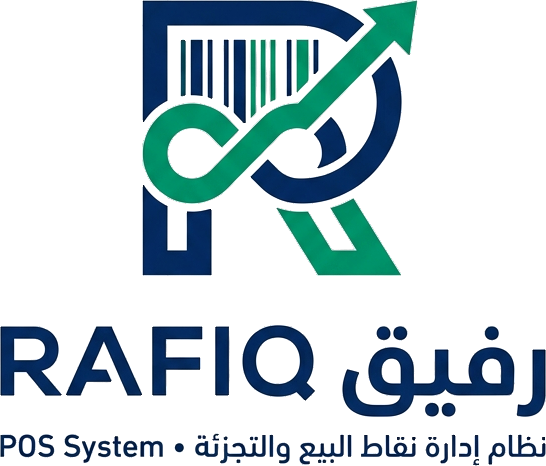
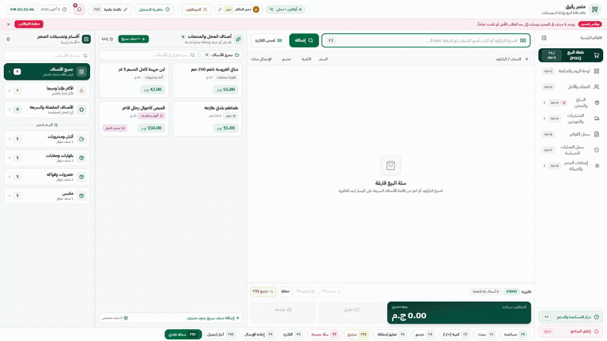
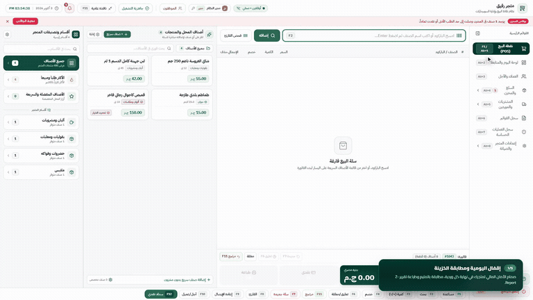
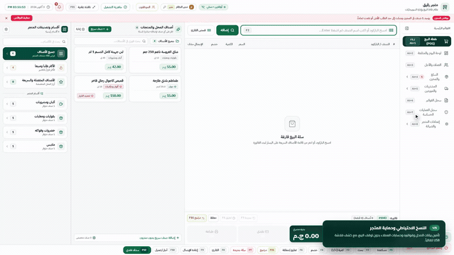
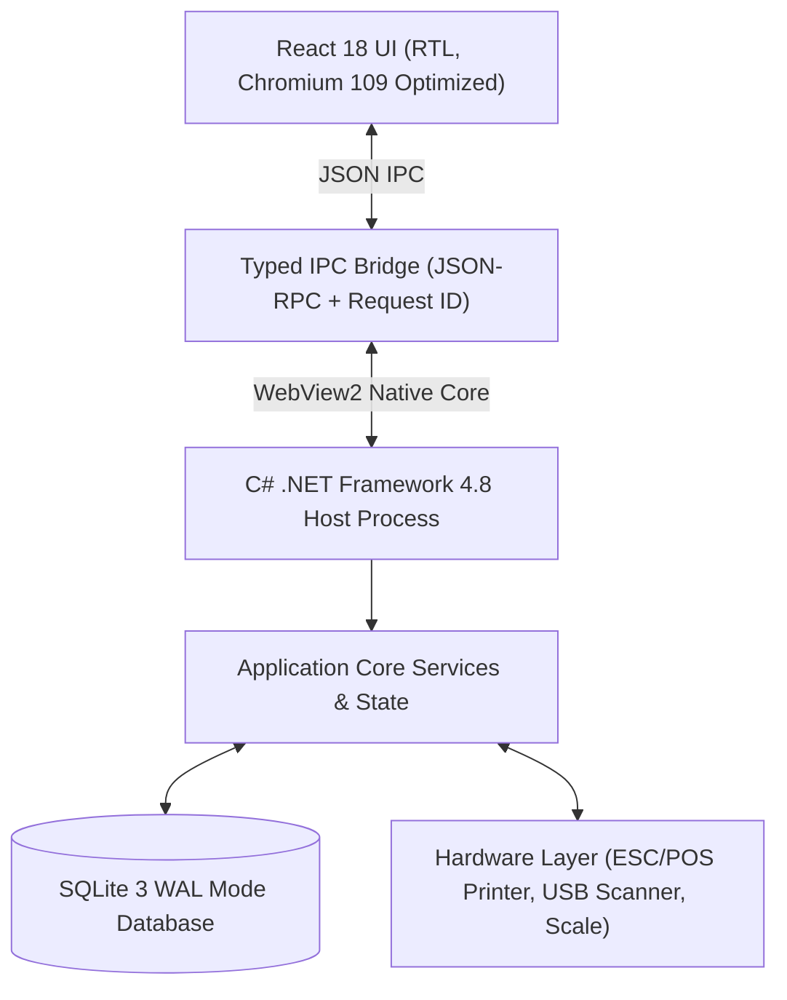

# <p align="center"><picture><source media="(prefers-color-scheme: dark)" srcset="branding/logo_full_dark.png"><source media="(prefers-color-scheme: light)" srcset="branding/logo_full.png"></picture><br/><b>نظام رفيق لإدارة نقاط البيع والسوبرماركت (Rafiq POS)</b><br/><sub>Enterprise-Grade, Offline-First Supermarket &amp; Retail Management System</sub></p>

<p align="center">
  <a href="https://dotnet.microsoft.com/en-us/download/dotnet-framework/net48"></a>
  <a href="https://react.dev/"></a>
  <a href="https://www.sqlite.org/"></a>
  
  
  
  
</p>

---

## نظرة عامة (Overview)

**رفيق (Rafiq POS)** هو نظام برمجي متكامل فائق السرعة لنقاط البيع وإدارة السوبرماركت ومحلات التجزئة، مصمم هندسياً للعمل المستقل **بدون إنترنت نهائياً (Offline-First)** مع أمان مالي صارم ومناعة كاملة ضد أخطاء التقريب العشري وانقطاع الكهرباء المفاجئ.

يعمل النظام عبر **حزمة تثبيت مستقلة واحدة** تدعم التثبيت والتشغيل الفوري بسلاسة تامة على جميع إصدارات ويندوز من **Windows 7 SP1 (32-bit و 64-bit)** ومروراً بـ **Windows 8.1 / 10** وحتى **Windows 11**، مع استهلاك اقتصادي جداً لموارد الجهاز (**RAM < 150MB**) وسرعة استجابة فائقة تضاهي سرعة الكاشير المحترف.

---

## فهرس المحتويات (Table of Contents)

1. [العروض المرئية والتفاعلية (Interactive Video Showcases)](#العروض-المرئية-والتفاعلية-interactive-video-showcases)
2. [الميزات الجوهرية للنظام (Key Features)](#الميزات-الجوهرية-للنظام-key-features)
3. [المعمارية الهندسية والقواعد الصارمة (Architecture & Senior Invariants)](#المعمارية-الهندسية-والقواعد-الصارمة-architecture--senior-invariants)
4. [اختصارات الكاشير ولوحة المفاتيح (Keyboard Shortcuts F1-F12)](#اختصارات-الكاشير-ولوحة-المفاتيح-keyboard-shortcuts-f1-f12)
5. [مصفوفة الأجهزة والطرفيات المعتمدة (Certified Hardware Compatibility)](#مصفوفة-الأجهزة-والطرفيات-المعتمدة-certified-hardware-compatibility)
6. [الأمان المالي ومقاومة انقطاع الكهرباء (Financial Integrity & Disaster Recovery)](#الأمان-المالي-ومقاومة-انقطاع-الكهرباء-financial-integrity--disaster-recovery)
7. [هيكل المشروع (Project Directory Layout)](#هيكل-المشروع-project-directory-layout)
8. [دليل التشغيل السريع (Quick Start Guide)](#دليل-التشغيل-السريع-quick-start-guide)
9. [بناء ملف التثبيت المستقل (Production Packaging)](#بناء-ملف-التثبيت-المستقل-production-packaging)
10. [خارطة الطريق والتقدم (Roadmap & Status)](#خارطة-الطريق-والتقدم-roadmap--status)

---

## العروض المرئية والتفاعلية (Interactive Video Showcases)

يحتوي النظام على مكتبة مرئية شاملة وتفاعلية تشرح أهم دورات العمل في السوبرماركت ومحلات التجزئة، بصوت بشري استوديو واضح وعالي النقاء وجودة **1080p Full HD**:

---

### 1. دورة البيع الكاملة وشاشة الكاشير (POS Cashier Master Workflow)

<p align="center">
  
</p>

<p align="center">
  <a href="frontend/public/videos/video1_first_sale.mp4">
    
  </a>
</p>

<details>
<summary><b>تفاصيل سيناريو دورة البيع الكاملة (اضغط للتفاصيل)</b></summary>

* **مسح الباركود الذكي:** قراءة فورية مع معالجة وتصحيح تلقائي لحروف لوحة المفاتيح عند الكتابة باللغة العربية بالخطأ دون الحاجة لتحويل لغة الويندوز.
* **البحث السريع بالكيبورد (`F2`):** كتابة الحروف الأولى، التنقل بالأسهم، والإنزال في السلة بـ `Enter` بدون لمس الفأرة نهائياً.
* **الميزان الإلكتروني للأصناف الموزونة:** نافذة قراءة فورية تحسب الوزن الصافي والسعر بالقروش بدقة متناهية.
* **الأصناف متغيرة الخصائص (Variants):** نافذة اختيار المقاسات، النكهات، والعبوات بضغطة زر واحدة.
* **تعليق واسترجاع الفواتير (`F6`):** إمكانية تعليق الفاتورة فوراً لخدمة عميل مستعجل والعودة إليها بكامل محتوياتها بثانية واحدة.
* **السداد النقدي والآجل:** حساب الباقي تلقائياً، إعطاء تنبيه فوري بالبصريات عند تجاوز حد ائتمان العميل، وفتح درج النقدية عبر إشارة الكاش درور الكهربائية وطباعة إيصال الفاتورة الحراري (80mm / 57mm).
</details>

---

### 2. إقفال الوردية ومطابقة الخزينة بالمليم (Shift Closing & Z-Report)

<p align="center">
  
</p>

<p align="center">
  <a href="frontend/public/videos/video2_z_report.mp4">
    
  </a>
</p>

<details>
<summary><b>تفاصيل سيناريو قفل الوردية والـ Z-Report (اضغط للتفاصيل)</b></summary>

* **الحساب التلقائي للعهد:** حساب إجمالي مبيعات الكاش، ومبيعات الآجل، والمرتجعات، والمصروفات، والمبلغ الفعلي المفترض وجوده في الخزينة.
* **مطابقة النقد المعدود:** إدخال النقد الفعلي؛ وفي حال وجود أي عجز أو زيادة يقوم النظام بتوضيح الفارق بالمليم، وعند المطابقة التامة تظهر شارة الاعتماد الخضراء (100% تطابق تام).
* **تجميد السجلات في SQLite WAL:** ترحيل الوردية آلياً مع حظر تعديل أي فاتورة تابعة لتلك الفترة نهائياً لحماية أصحاب المحال من التلاعب.
* **طباعة شريط الـ Z-Report:** إخراج إيصال إقفال مالي حراري تفصيلي وموجز للتسليم والاستلام.
</details>

---

### 3. النسخ الاحتياطي وحزمة نقل المحل المستقلة (.rafiqpkg Migration)

<p align="center">
  
</p>

<p align="center">
  <a href="frontend/public/videos/video3_backup_migration.mp4">
    
  </a>
</p>

<details>
<summary><b>تفاصيل سيناريو النسخ الاحتياطي والترحيل الشامل (اضغط للتفاصيل)</b></summary>

* **النسخ الحي بضغطة زر (Zero-Downtime Backup):** أخذ نسخة احتياطية فورية دون إيقاف البيع باستخدام تقنية SQLite Backup API مع التحقق الآلي من سلامة الجداول عبر `PRAGMA integrity_check`.
* **الحفظ المباشر على فلاشات USB الخارجية:** كشف تلقائي لأقراص التخزين الخارجية وحفظ النسخ بأسماء مؤرخة تلقائياً.
* **حزمة نقل المحل (.rafiqpkg):** تصدير كامل بيانات المتجر (المنتجات، الحسابات، الأرصدة، الفواتير، الإعدادات) في حزمة مضغوطة ومشفرة ببصمة SHA256 لنقل المحل لجهاز جديد في أقل من 30 ثانية بدون الاستعانة بأي مبرمج أو خبير شبكات.
</details>

---

## الميزات الجوهرية للنظام (Key Features)

| التصنيف | الميزة التقنية | الوصف التجاري والتطبيقي |
| :--- | :--- | :--- |
| **سرعة الكاشير** | **Zero-Mouse POS** | تنفيذ دورة البيع الكاملة عبر لوحة المفاتيح بنسبة 100% دون الحاجة لاستخدام الماوس. |
| **البحث الذكي** | **Arabic Auto-Fix** | معالجة فورية عند كتابة الباركود أو اسم الصنف باللغة العربية خطأً وتحويله آلياً. |
| **الموازين الإلكترونية** | **Scale Integration** | دعم الموازين الإلكترونية عبر بروتوكولات الوزن القياسية لحساب الأسعار بالقروش فورياً. |
| **إدارة الديون والعملاء** | **Credit & Aging Ledger** | كشوف حسابات تفصيلية للعملاء، وتنبيهات فورية بحدود الائتمان وسجل فواتير الآجل. |
| **الفواتير الحرارية** | **Raw ESC/POS Driver** | دعم مباشر لطابعات الفواتير 80mm و 57mm بدون الحاجة لتثبيت تعريفات ويندوز المعقدة. |
| **الخزينة والورديات** | **Z-Report Reconciliation** | تقفيل اليومية ومطابقة العهدة النقدية ومنع التلاعب مع طباعة تقارير Z-Report الدقيقة. |
| **مناعة انقطاع الكهرباء** | **ACID WAL Protection** | استقرار كامل لقاعدة البيانات حتى عند سحب كابل الكهرباء أثناء طباعة الفاتورة. |
| **نقل المحل المتكامل** | **Portable .rafiqpkg** | حزم بيانات ذاتية النقل بضغطة زر واحدة للتنقل بين الأجهزة بدون استدعاء فني. |

---

## المعمارية الهندسية والقواعد الصارمة (Architecture & Senior Invariants)

تم بناء نظام رفيق وفق معمارية فصل الطبقات الصارمة (Clean Architecture) لضمان الاستقرار التام وسرعة التنفيذ:



### القواعد الهندسية الست الصارمة (Senior Engineering Invariants)

1. **الأمان المالي المطلق (Integer Financial Arithmetic):**
   * ممنوع منعاً باتاً استخدام `float` أو `double` في أي عملية حسابية مالية أو تخزين للمبالغ.
   * تُحسب وتُخزّن جميع الأسعار والمبالغ والضرائب والخصومات **بالقروش كأعداد صحيحة (`long` في C# و `number` صحيح في TypeScript)**.
   * التحويل للجنيه (`amount / 100.0`) يتم فقط وحصرياً في شاشات العرض النهائية للمستخدم.
2. **المعاملات الذرية وحماية انقطاع الكهرباء (ACID Transactions):**
   * أي عملية بيع، خصم مخزن، سداد آجل، أو ترحيل مالي تُنفذ بالكامل داخل **معاملة ذرية واحدة (`conn.BeginTransaction()`)**.
   * وضع قاعدة البيانات دائماً: `PRAGMA journal_mode = WAL; PRAGMA synchronous = NORMAL; PRAGMA foreign_keys = ON;`.
3. **التوافقية الشاملة حتى Windows 7 SP1 (Universal Windows Support):**
   * الالتزام التام بـ **.NET Framework 4.8** ومحرك **WebView2 Fixed Version 109** لويندوز 7 و 8.1، ومحرك **Evergreen** لويندوز 10 و 11.
   * ضبط بناء الواجهة (Vite) على `chrome109` / `es2020`، واستخدام Tailwind CSS 3.4 المتوافق مع الإصدارات القديمة.
4. **الخطوط والأصول المدمجة محلياً (Zero External CDN):**
   * جميع الخطوط العربية (Cairo و Tajawal) والأيقونات مدمجة ومحملة محلياً 100% ولا يتم طلب أي ملف عبر الإنترنت.
5. **منع الأكواد المهملة (Zero Unused Code):**
   * التزام صارم بـ `"noUnusedLocals": true` و `"noUnusedParameters": true` وفحص `oxlint` الصارم.
6. **الهوية البصرية المتناسقة ومنع وسوم الـ HTML الافتراضية:**
   * منع استخدام وسم `<select>` الافتراضي واستبداله بمكون `CustomSelect` لتفادي مظهر ويندوز 7 الشاذ.
   * الالتزام بألوان النظام الرسمية المحددة في توكنز `tailwind.config.js` (أخضر الغابة المالي `#004D3F` والخلفية المتناسقة `#F8FAFC`).

---

## اختصارات الكاشير ولوحة المفاتيح (Keyboard Shortcuts F1-F12)

| الاختصار | الوظيفة | الوصف العملي في بيئة السوبرماركت |
| :---: | :--- | :--- |
| `F1` | **دليل الاختصارات والمساعدة** | فتح نافذة المساعدة السريعة ودليل الكاشير التدريبي. |
| `F2` | **البحث السريع عن صنف** | فتح نافذة البحث الذكي بالاسم أو الصنف والتنقل بالأسهم. |
| `F3` | **الباركود اليدوي** | توجيه المؤشر لحقل قراءة الباركود فورياً للمسح أو الإدخال اليدوي. |
| `F4` | **تعديل الكمية** | تعديل كمية الصنف المحدد حالياً في السلة بضغطة زر. |
| `F5` | **تحديث البيانات** | تحديث شاشة البيع وتزامن الأرصدة والأسعار. |
| `F6` | **تعليق / استرجاع الفاتورة** | تعليق الفاتورة الحالية لخدمة عميل آخر والتبديل بين الفواتير المعلقة. |
| `F7` | **إضافة خصم على الفاتورة** | تطبيق خصم بالقروش أو نسبة مئوية محددة بصلاحية الكاشير. |
| `F8` | **اختيار العميل / الآجل** | تحديد حساب العميل للبيع الآجل أو تسجيل نقاط الولاء. |
| `F9` | **السداد النقدي السريع** | فتح نافذة الدفع النقدي وحساب الباقي بضغطة واحدة. |
| `F10` | **الدفع الإلكتروني / فيزا** | السداد عبر نقاط البيع الإلكترونية (POS Card Terminal). |
| `F11` | **إقفال اليومية (Z-Report)** | الانتقال المباشر لشاشة تقفيل الوردية وعد النقدية في الدرج. |
| `F12` | **فتح درج النقدية يدوياً** | إرسال نبضة كهربائية لفتح درج النقدية فوراً لحالات الصرف الطارئ. |
| `Esc` | **إلغاء / رجوع** | إغلاق أي نافذة منبثقة أو إلغاء السطر المحدد بالسلة. |

---

## مصفوفة الأجهزة والطرفيات المعتمدة (Certified Hardware Compatibility)

| نوع الجهاز | البروتوكول المدعوم | الموديلات والماركات المختبرة والمعتمدة |
| :--- | :--- | :--- |
| **طابعات الفواتير الحرارية** | Direct USB / Virtual COM (ESC/POS) | Xprinter (XP-N160M, XP-Q800), Epson (TM-T20, TM-T88), Bixolon, Rongta, Sunmi (80mm & 57mm). |
| **قارئات الباركود** | USB HID Keyboard Emulation / 1D & 2D | Honeywell Voyager, Zebra (Symbol LS2208), Datalogic QuickScan, Netum Wireless, Generic CCD Scanners. |
| **الموازين الإلكترونية** | RS-232 Serial COM / USB-to-Serial | CAS (PD-II, ER Plus), Rongta RLS1000, Mettler Toledo (Continuous Protocol: `ST,GS,+00.500kg`). |
| **أدراج النقدية** | RJ11 / RJ12 Kicker Pin (24V / 12V) | Standard Posiflex, Rongta, Xprinter Kick-out drawers (Drawer Pin 2/5). |
| **شاشات العرض للعميل** | VFD / Line Display (COM ESC/POS) | 2x20 Characters Customer Pole Displays. |

---

## الأمان المالي ومقاومة انقطاع الكهرباء (Financial Integrity & Disaster Recovery)

```
[انقطاع كهرباء مفاجئ] 
       |
[سجل الكتابة المسبق WAL مفعّل] ---> [استرجاع فوري لآخر معاملة ناجحة عند الإقلاع]
       |
       +---> [حظر الحذف المادي: أي تسوية تتم بقيد محاسبي معاكس (Contra Entry)]
```

* **بيانات نقدية محمية:** حفظ مستمر لكل سطر في الفاتورة داخل سجل الـ WAL؛ لا تفقد أي فاتورة حتى وإن أُغلق الجهاز بنزع القابس مباشرة.
* **فحص السلامة الآلي:** تشغيل أمر `PRAGMA quick_check;` عند إقلاع البرنامج لضمان سلامة فهرسة الجداول ومفاتيحها.
* **حظر التعديل اليدوي:** تشفير وإقفال سجلات الإقفال اليومي لضمان حماية أرباح التاجر وصاحب العمل.

---

## هيكل المشروع (Project Directory Layout)

```
RAFIQ/
├── ARCHITECTURE_AND_PLAN.md      # وثيقة المعمارية الهندسية الشاملة
├── PROJECT_BACKLOG.md            # سجل المهام والقصص (12 محطة و 413 مهمة)
├── CERTIFIED_HARDWARE_GUIDE.md   # دليل توصيل وضبط الطابعات والموازين وقارئات الباركود
├── UI_DESIGN_CATALOG.md          # كتالوج ومراجع واجهات وتصاميم النظام
├── branding/                     # الهوية البصرية الرسمية والأيقونات عالية الدقة
│   ├── logo_full.png             # شعار النظام الرسمي للوضع الفاتح
│   ├── logo_full_dark.png        # شعار النظام عالي التباين للوضع الداكن
│   └── app_icon_512.png          # أيقونة التطبيق بدقة 512x512
├── docs/                         # التوثيق والعروض التوضيحية
│   └── assets/demos/             # العروض المتحركة المصغرة (GIFs & Posters)
├── frontend/                     # واجهة المستخدم الحديثة (React 18 + TypeScript + Vite + Tailwind)
│   ├── public/videos/            # الفيديوهات التدريبية عالية الدقة 1080p بصوت استوديو
│   └── src/components/           # مكونات الواجهة وتجربة البيع ونوافذ المساعدة
├── desktop/                      # المضيف المكتبي المدمج (C# .NET Framework 4.8 WinForms)
│   ├── Services/                 # خدمات قاعدة البيانات والطرفيات والأجهزة
│   └── RafiqPOS.csproj           # ملف مشروع المضيف
├── installer/                    # سكريبتات ومخرجات حزمة التثبيت الموحدة
│   └── setup_script.iss          # سكريبت Inno Setup 6
├── video_generator/              # محرك استوديو إنتاج الفيديوهات وتوليد الشاشات
├── تشغيل_رفيق.bat                # تشغيل البرنامج المكتبي مباشرة بضغطة زر
├── تشغيل_وضع_المطور.bat          # تشغيل واجهة الويب في وضع التطوير (Dev Mode)
└── انشاء_ملف_التثبيت_Setup.bat   # بناء وتجميع ملف التثبيت النهائي المستقل (.exe)
```

---

## دليل التشغيل السريع (Quick Start Guide)

### أولاً: للمستخدم وصاحب السوبرماركت (Store Run)

1. اضغط مرتين على ملف:
   ```cmd
   تشغيل_رفيق.bat
   ```
2. سيعمل البرنامج فوراً وستفتح شاشة البيع بدون أي خطوات إضافية أو حاجة لتثبيت برامج وسيطة.

---

### ثانياً: للمطورين والمبرمجين (Developer Setup)

#### 1. المتطلبات المسبقة (Prerequisites):
* **Node.js** (الإصدار 18 أو 20 LTS).
* **.NET Framework 4.8 Developer Pack**.
* **Visual Studio Build Tools / MSBuild**.

#### 2. تشغيل واجهة التطوير (Frontend Dev Mode):
```bash
cd frontend
npm install
npm run dev
```
أو بضغطة زر واحدة عبر:
```cmd
تشغيل_وضع_المطور.bat
```

#### 3. فحص الأكواد والجودة (Linting & Build):
```bash
cd frontend
npm run lint
npm run build
```

#### 4. بناء مشروع المضيف المكتبي (C# Desktop Host):
```cmd
MSBuild desktop\RafiqPOS.csproj /p:Configuration=Release /p:Platform="Any CPU"
```

---

## بناء ملف التثبيت المستقل (Production Packaging)

يتم إنتاج ملف تثبيت تنفيذي واحد مستقل تماماً بحجم مضغوط يحتوي على كافة مكونات النظام ومحرك الويب المدمج ليعمل على أي كمبيوتر ويندوز 7 أو 10 أو 11 بدون إنترنت:

1. تأكد من تثبيت **Inno Setup 6**.
2. اضغط مرتين على ملف:
   ```cmd
   انشاء_ملف_التثبيت_Setup.bat
   ```
3. سيقوم السكريبت آلياً بـ:
   * فحص بيئة البناء وتثبيت حزم الـ NPM.
   * بناء واجهة React بنسخة الإنتاج الموجهة لـ Chromium 109.
   * ترجمة مشروع C# .NET 4.8 بوضع الـ Release.
   * تجميع ملف التثبيت النهائي في مسار:
     `installer/Output/RafiqPOS_Setup_v1.0.0.exe`.

---

## خارطة الطريق والتقدم (Roadmap & Status)

النظام يتم تطويره وفق منهجية المحطات الصارمة (12 محطة و 413 مهمة معمارية موثقة في [PROJECT_BACKLOG.md](./PROJECT_BACKLOG.md)):

- [x] **المحطة 1:** تأسيس معمارية النواة والتوافقية الصارمة لويندوز 7 حتى 11 ووضع SQLite WAL.
- [x] **المحطة 2:** بناء جسر الاتصال المكتوب (Typed IPC Bridge) ومحرك استهلاك الذاكرة الاقتصادي.
- [x] **المحطة 3:** هندسة الأمان المالي المطلق (Integer Piasters) وحسابات الفواتير والضرائب.
- [x] **المحطة 4:** شاشة البيع السريع (POS Master Screen) ودعم الباركود والبحث الذكي والميزان.
- [x] **المحطة 5:** إدارة الأصناف المتعددة (Variants) والمخازن ومحركات الجرد المستمر.
- [x] **المحطة 6:** كشوف حسابات العملاء، البيع الآجل، وحدود الائتمان وسجل السداد.
- [x] **المحطة 7:** تقفيل الوردية، مطابقة الخزينة، وإصدار تقارير الـ Z-Report والـ X-Report.
- [x] **المحطة 8:** تعريفات الطرفيات المباشرة لطابعات الفواتير الحرارية ESC/POS والموازين.
- [x] **المحطة 9:** النسخ الاحتياطي الحي وحزمة نقل المحل المستقلة (.rafiqpkg).
- [x] **المحطة 10:** إنتاج حزمة التثبيت المستقلة (Inno Setup) وفحص المتطلبات المسبقة تلقائياً.
- [x] **المحطة 11:** استوديو العروض التوضيحية والفيديوهات التدريبية المدمجة عالية الدقة 1080p.
- [x] **المحطة 12:** اختبارات التحمل (Stress Testing)، اختبار انقطاع الكهرباء الفجائي، والتوثيق المكتمل.

---

<p align="center">
  <b>رفيق — نظامك المخلص لإدارة المبيعات والتجارة الذكية</b><br/>
  صُنع بإتقان لأعلى معايير الاستقرار والأمان المالي.
</p>
